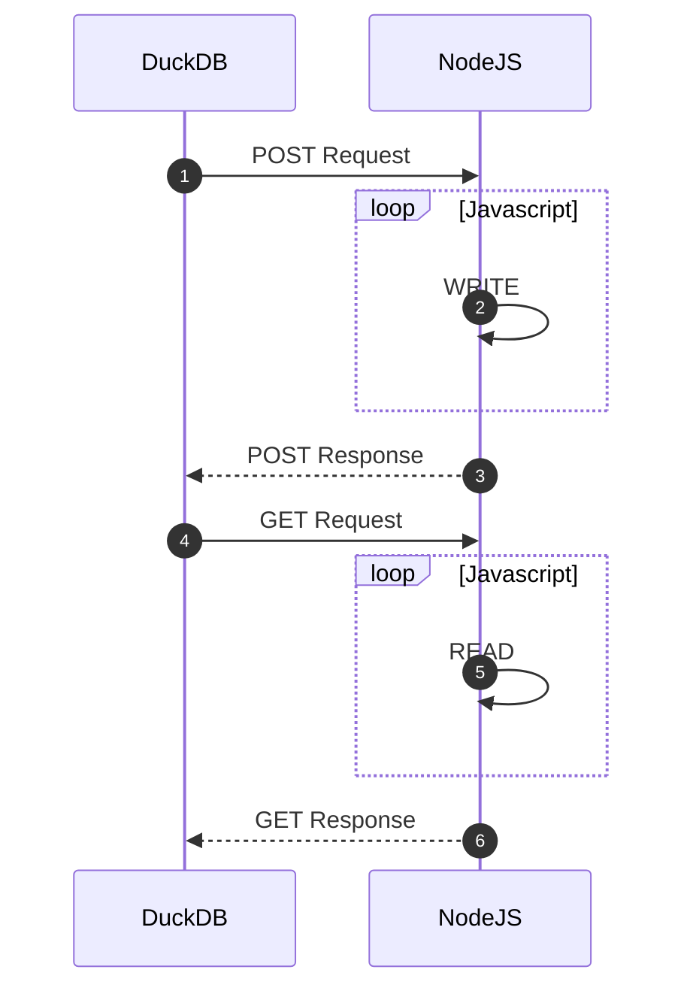

# DuckDB URL Engine
This basic example is designed to explore [DuckDB HTTPFS](https://duckdb.org/docs/extensions/httpfs/https.html) remote read/write integrations.

### Demo
A public demo instance is available at [https://duckserver.glitch.me](https://duckserver.glitch.me)




##### Features
- [x] INSERT Files via POST
- [x] SELECT Files via GET

#### Usage
##### Golang
Install and run the example service :
```
cd go/
go mod tidy
PORT=80 go run server.go
```
##### NodeJS
Install and run the example service :
```
cd nodejs/
npm install
PORT=80 npm start
```

#### 📦 DuckDB

You can COPY and SELECT from the URL Engine using extensions `json`,`csv`,`parquet`

```sql
D SET enable_http_write = 1;

D COPY (SELECT version() as version, 9999 as number) TO 'https://duckserver.glitch.me/test.json';
D SELECT * FROM read_json_auto('https://duckserver.glitch.me/test.json');
┌─────────┬────────┐
│ version │ number │
│ varchar │ int64  │
├─────────┼────────┤
│ v1.1.0  │   9999 │
└─────────┴────────┘

D COPY (SELECT version() as version, 9999 as number) TO 'https://duckserver.glitch.me/test.parquet';
D SELECT * FROM read_parquet('https://duckserver.glitch.me/test.parquet');
┌─────────┬────────┐
│ version │ number │
│ varchar │ int64  │
├─────────┼────────┤
│ v1.1.0  │   9999 │
└─────────┴────────┘

D SELECT * FROM parquet_schema('https://duckserver.glitch.me/test.parquet');
┌──────────────────────┬───────────────┬────────────┬─────────────┬───┬────────────────┬───────┬───────────┬──────────┬──────────────┐
│      file_name       │     name      │    type    │ type_length │ … │ converted_type │ scale │ precision │ field_id │ logical_type │
│       varchar        │    varchar    │  varchar   │   varchar   │   │    varchar     │ int64 │   int64   │  int64   │   varchar    │
├──────────────────────┼───────────────┼────────────┼─────────────┼───┼────────────────┼───────┼───────────┼──────────┼──────────────┤
│ https://duckserver…  │ duckdb_schema │            │             │ … │                │       │           │          │              │
│ https://duckserver…  │ version       │ BYTE_ARRAY │             │ … │ UTF8           │       │           │          │              │
│ https://duckserver…  │ number        │ INT32      │             │ … │ INT_32         │       │           │          │              │
├──────────────────────┴───────────────┴────────────┴─────────────┴───┴────────────────┴───────┴───────────┴──────────┴──────────────┤
│ 3 rows                                                                                                        11 columns (9 shown) │
└────────────────────────────────────────────────────────────────────────────────────────────────────────────────────────────────────┘
```

